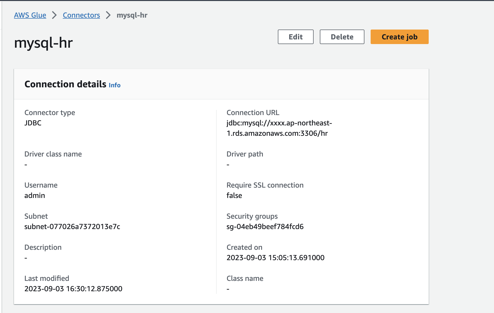
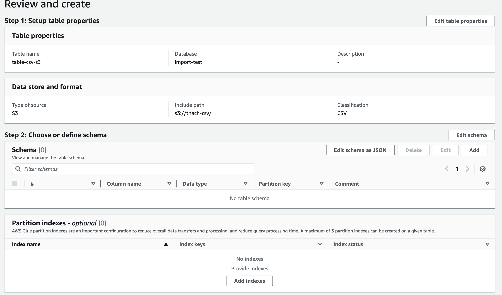
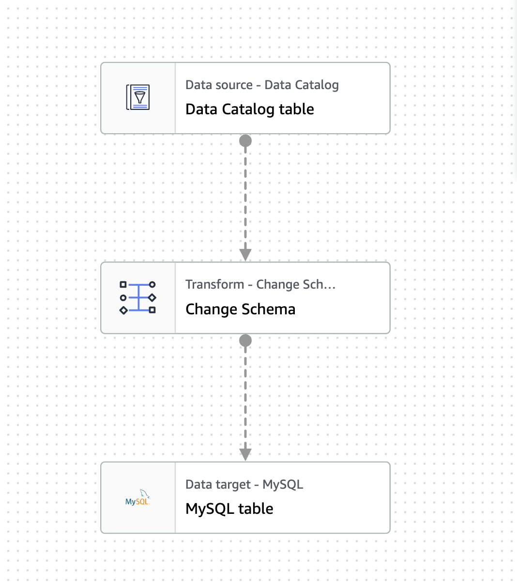

# AWS Glue S3 to RDS (mysql)
intro: mục đích để process large data từ csv và import vào rds mysql, aws glue sử dụng Pyspark để proces data.

1. Setup Role and Policy 

2. Setup S3
    - Tạo S3 với những config default ( hoặc như bạn mong muốn )
3. Setup RDS Mysql
    - Tạo RDS Aurora với VPC và Subnet default
4. Create database in AWG Glue
in example i have create 2 database
- import-csv: database to detect csv from S3
- hr-mysql: database to detect table from RDS
5. Create Data Connection 
mục đích để tạo connection tới Rds Mysql, lúc sau Glue nó sẻ dùng nó để commit data vào mysql
những hạng mục setting cần lưu ý
    - JDBC URL: path jdbc của Rds, ex: `jdbc:mysql://xxx.yyy.ap-northeast-1.rds.amazonaws.com:3306/hr`, có thể thay đổi driver mysql thaành những database khác như:
        - mysql for MySQL
        - postgresql for PostgreSQL
        - oracle:thin for Oracle Thin
        - oracle:oci for Oracle OCI
        - oracle:oci8 for Oracle OCI 8
        - oracle:kprb for Oracle KPRB
        - sqlserver for SQL Server
    - Network Option: bởi vì stack của Glue cần Instance ( PySpark ) để xử lý và lưu data vào mysql, nên phải config VPC, SubNet, Security Group làm sao cho nó có thể access được database
        - VPC: cùng vpc với DB
        - Subnet: cùng subnet với DB
        - Security Group : allow port inbound cho Glue sau khi tạo data connection mình có thể test connection, nếu gặp lỗi S3 End Point thì cần phải tạo End Point cho VPC và Subnet trên.  
    
    VPC > EndPoint để tạo endpoint, cần setting như sau:

        - VPC: chọn VPC như ở step setting Network Option
        - ServiceName: com.amazonaws.ap-northeast-1.s3
        - EndPoint Type: Gateway
        - Policy: Full access

    

6. Create Table to detect S3 File
      
    setup như image trên
        Data Store ( nơi data cần detect )

        - Database: chọn `import-csv` đã tạo ở trên
        - Type: `S3`
        - Path: S3 path, ex: `s3://thach-csv`
        - Classfication : `CSV` ( tuỳ loại file lưu trũ mà có thể chọn class tương tứng )

        *sau khi tạo table mình có thể preview data

7. Create  Crawler
tại sao phải tạo crawler mà k phải là table trong Glue, vì Glue Table chỉ support S3, Kenises, Kafka, ở đay mình dùng Mysql
- Data sources and classifiers: add a datasource JDBC với setting
    - Data Source: JDBC
    - Connection: chọn connection đã tạo ở trên
    - Include Path: `hr/%` ( hr là tên database, % là tất cả các table trong database )
- Configure security settings: chọn role đã tạo ở trên
- Set output and scheduling
    - Target Database: chọn database `hr-mysql` đã tạo ở trên
    - Crawler schedule: chọn `Run on demand` ( chạy theo yêu cầu )

    sau khi tạo xong chọn `Run Crawler` để chạy crawler, Glue sẻ tự động tạo ra table trong Glue Table `
    hr_employee` với classification là mysql

8. Create ELT Job: để chuyển đổi dữ liệu từ S3 sang RDS Mysql

    

    tạo ELT Job với workflow như trên:

    - Data source: Data Catlog table với Glue Database/table đã tạo 
    - Transform: để transform column name csv thành column name trong Mysql 
    - Data target: Mysql với Glue Database/table đã tạo 

    Save, and run and check the table employee trong RDS